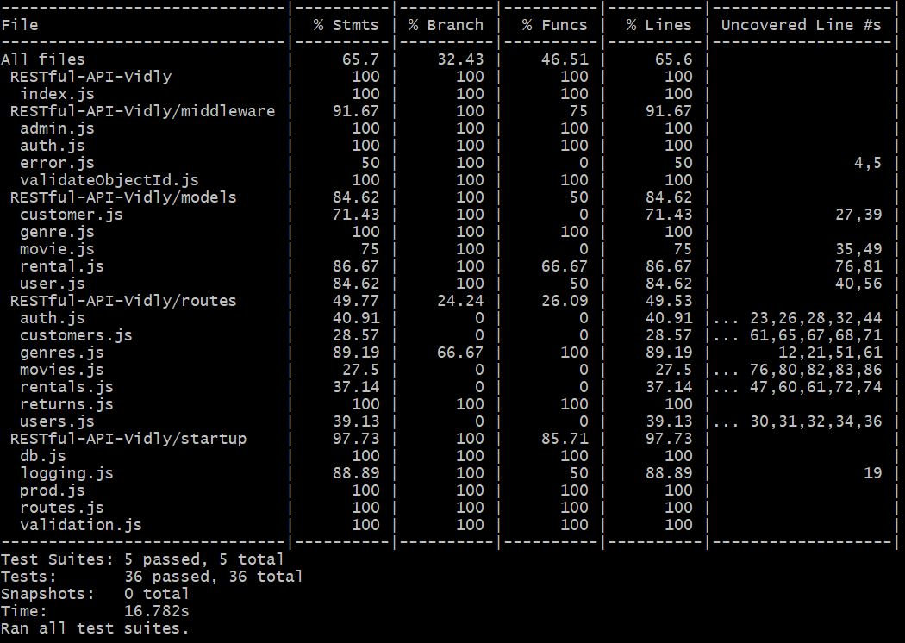

# RESTful-API-Vidly
fast, scalable and secure REST API for a video rental application. 
[View online](https://vidly-backend-api.herokuapp.com)

## Tech Used
ES6 JavaScript, Node.js, Express.js, MongoDB, JWT, Git, Heroku

## Features
-	Implement CRUD operations 
-	Store complex data in MongoDB  
-	Authentication and authorization  
-	Data validation  
-	Handle and log errors
-	Unit and integration tests
-	Test-driven development (TDD)

## Resources
/api/auth

/api/users

/api/genres

/api/movies

/api/customers

/api/rentals

/api/returns

Note: resources have relations. For example: movie has genre, rental has movie and customer. 

## Routes
POST /api/auth – store management login (token will be sent in response)

POST /api/users – store management registration (token will be sent in response header x-auth-token)

GET /api/users/me  -  current user (Protected route. Request header x-auth-token should have correct token)

GET /api/genres

GET /api/genres/:id  

POST /api/genres  (Protected route. Request header x-auth-token should have correct token)

PUT /api/genres/:id (Protected route. Request header x-auth-token should have correct token)

DELETE /api/genres/:id  (Protected route. Store management administrator only)

GET /api/movies

GET /api/movies/:id

POST /api/movies (Protected route. Request header x-auth-token should have correct token)

PUT /api/movies/:id (Protected route. Request header x-auth-token should have correct token)

DELETE /api/movies/:id (Protected route. Request header x-auth-token should have correct token)

GET /api/customers

GET /api/customers/:id

POST /api/customers (Protected route. Request header x-auth-token should have correct token)

PUT /api/customers/:id (Protected route. Request header x-auth-token should have correct token)

DELETE /api/customers/:id (Protected route. Request header x-auth-token should have correct token)

GET /api/rentals

GET /api/rentals/:id

POST /api/rentals (Protected route. Request header x-auth-token should have correct token)

POST /api/returns (Protected route. Request header x-auth-token should have correct token)

## Test Code Coverage
still working on unit and integration tests. Till now, the code coverage is


## Run in Local Machine
You will need to create file keys_dev.js and keys_test.js in config folder with
```
module.exports = {
  db: 'YOUR_OWN_MONGO_URI',
  jwtPrivateKey: 'YOUR_OWN_SECRET'
};
```
Then start: 
```
# Install dependencies for server
npm install

# Run the Express server 
node index.js

# Server runs on http://localhost:5000
```

